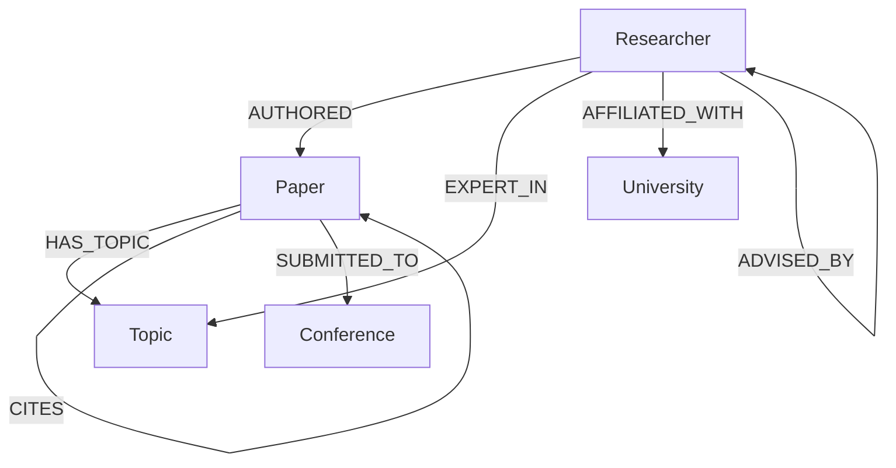

# Reviewer Finder

## Overview
Reviewer Finder is a graph-based Next.js application that helps a conference or journal editor find the best reviewers for a research paper while automatically detecting and explaining potential conflicts of interest. It leverages CognoDB (Neo4j) to map researchers, papers, topics, and institutions, using graph traversal to find both suitability and eligibility.

## Problem Statement
Finding qualified reviewers is a relationship-heavy problem. An editor needs to know not only who has the right expertise but also who is *allowed* to review the paper. A researcher might be highly qualified but ineligible due to a conflict of interest, such as co-authoring a paper with the applicant, sharing the same university affiliation, or having an advisor/advisee relationship. Traditional relational databases struggle to elegantly traverse these multi-hop relationships.

## Product Workflow
1. **Candidate discovery**: Find researchers who are experts in the paper's topics.
2. **Suitability scoring**: Rank them based on the number of matching topics.
3. **Conflict detection**: Traverse the graph to find co-author, same-university, and advisor conflicts.
4. **Eligibility filtering**: Separate candidates into "Recommended" and "Excluded".
5. **Final ranking & Explanation**: Present the results with clear explanations and visual graphs.

## Why a Graph Database?
The core problem is entirely about relationships. To find a co-author conflict, the system must traverse `Reviewer -> AUTHORED -> Shared Paper <- AUTHORED <- Paper Author`. Relational databases require complex and expensive JOINs for these multi-hop queries. Graph databases treat relationships as first-class citizens, making traversal natural, fast, and easy to express using Cypher.

## Architecture
- **Frontend**: Next.js App Router, React, Tailwind CSS, React Flow (for graph visualization)
- **Backend Layer**: Next.js API Routes (Serverless)
- **Application Services**: Decoupled service layer for recommendation and scoring logic
- **Database**: CognoDB (Neo4j) accessed via the official `neo4j-driver` using parameterized Cypher queries.

## Graph Data Model


### Node Definitions
- **Researcher**: id, name, email, title, bio
- **Paper**: id, title, abstract, year, doi
- **Topic**: id, name
- **University**: id, name, country
- **Conference**: id, name, year

### Relationship Definitions
- `AUTHORED`: Links a Researcher to a Paper they wrote.
- `HAS_TOPIC`: Links a Paper to a Topic it covers.
- `EXPERT_IN`: Links a Researcher to a Topic they specialize in.
- `AFFILIATED_WITH`: Links a Researcher to their University.
- `ADVISED_BY`: Links an advisee Researcher to their advisor Researcher.
- `CITES`: Links a Paper to another Paper it references.
- `SUBMITTED_TO`: Links a Paper to a Conference.

## Conflict Detection Rules
1. **Co-Author Conflict**: Reviewer has co-authored any paper with any author of the target paper. (Severity: CRITICAL)
2. **Same University Conflict**: Reviewer shares a university affiliation with any author of the target paper. (Severity: HIGH)
3. **Advisor Conflict**: Direct advisor/advisee relationship exists between the reviewer and any author. (Severity: CRITICAL)

## Reviewer Scoring
Suitability is scored strictly based on topic overlap. The score increases by 20 points for each matching topic (capped at 95 to leave room for future heuristics like recency or citation count). 
*Note: Suitability is calculated completely separately from Eligibility. A high score does not override a conflict.*

## Main Cypher Queries
- **Paper details**: Fetches the paper node, OPTIONAL MATCH for authors, topics, and conferences.
- **Matching reviewers**: `MATCH (p:Paper)-[:HAS_TOPIC]->(t:Topic)<-[:EXPERT_IN]-(r:Researcher)`
- **Multi-hop traversal (Conflicts)**: e.g., `MATCH (reviewer)-[:AUTHORED]->(sharedPaper)<-[:AUTHORED]-(author)-[:AUTHORED]->(targetPaper)`
- **Relationship Explorer**: Uses `shortestPath` to find the exact graph path between a reviewer and the target paper/authors.

## Project Structure
- `src/app/`: Next.js App Router pages and API routes.
- `src/components/`: Reusable React components.
- `src/lib/db/`: Centralized Neo4j driver setup.
- `src/lib/queries/`: Cypher query definitions separated by domain.
- `src/lib/services/`: Business logic combining queries.
- `src/lib/scoring/`: Isolated scoring logic.
- `src/types/`: Shared TypeScript interfaces.
- `scripts/`: Database seeding scripts.
- `data/`: Deterministic seed data.

## Environment Setup
Copy `.env.example` to `.env` and fill in the CognoDB credentials:
```env
COGNODB_URI=bolt+s://db-***.bravo.databases.cognodb.com
COGNODB_USERNAME=cognodb
COGNODB_PASSWORD=your_password_here
```

## Local Development
1. Install dependencies: `npm install`
2. Run the seed script: `npm run seed`
3. Start the dev server: `npm run dev`
4. Open [http://localhost:3000](http://localhost:3000)

## Seed Data
The application uses a deterministic seed script (`npm run seed`) that clears the database and populates it with exactly 45 researchers, 30 papers, 20 topics, 8 universities, and 5 conferences. It deliberately constructs specific conflict scenarios (e.g., Dr. Priya Mehta has a co-author conflict) to ensure the UI demonstrates all features reliably.

## Testing
API endpoints are robust and handle database connection failures gracefully, returning standard 500 errors rather than crashing the application or leaking stack traces.

## Design Decisions
- **Next.js App Router**: Chosen for its seamless blend of server-side data fetching and client-side interactivity (like React Flow).
- **Separation of Concerns**: Queries are decoupled from UI components, ensuring the Cypher logic is easily testable and reusable.
- **Parameterized Queries**: All Cypher queries use parameterized inputs (`$id`) via the Neo4j driver to prevent injection attacks and improve query plan caching.
- **Explainability**: The system doesn't just return a score; it returns the exact matching topics and the specific conflict explanation, which is critical for academic editors.

## Trade-offs
- **In-memory Scoring**: Suitability scoring is done in the Node.js application layer rather than directly in Cypher. While Cypher could calculate the score, moving it to the application layer allows for easier integration with future non-graph heuristics (e.g., calling an external ML model).
- **Graph Layout**: The Relationship Explorer uses a simple layout algorithm for React Flow. In a massive graph, a directed acyclic graph (DAG) layout engine like Dagre would be better.

## Future Improvements
- Integrate a DAG layout engine (e.g., Dagre) for the relationship explorer.
- Add authentication for editors.
- Support importing papers directly from semantic scholar or Crossref.
- Implement more complex suitability scoring involving citation impact and publication recency.
